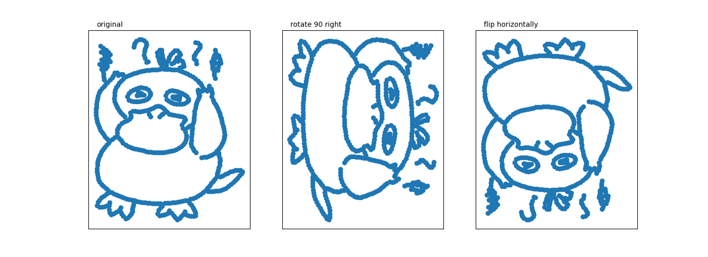

# DA5401 Assignment #1
**Roll no : DA24C021**
**Name : Venkatesh Duraiarasan**

### Data Acquisition [20 points]
Following hand drawn image was originally in JPEG format (**psyduck.jpeg**). It was converted into a CSV file (**psyduck.csv**) using external tools. The CSV file contains coordinates representing the non-zero pixel positions of the image, with each row indicating a pixel’s x and y coordinates.


### Data Cleansing & Loading [10 points]
- **Loading the Data:** The CSV file is read and loaded into a pandas DataFrame with columns `x` and `y`.
- **Offsetting Negative Coordinates:** If there are any negative coordinates, the code offsets them to ensure all values are non-negative.
- **Discretization:** The coordinates are scaled by a factor of 1000, converting them to integers to create a matrix representation.
- **Creating a Sparse Matrix:** A sparse matrix (**img_matrix**) is created, where each cell in the matrix represents a pixel, and the values are either 0 (absence of a pixel) or 1 (presence of a pixel). The maximum x or y value determines the size of the matrix.

### Transformation [10 points]
Two main image transformations are applied to the sparse matrix:

- **90-Degree Left Rotation:** This transformation is achieved by multiplying the transpose of the image matrix with a permutation matrix. The result is the 90-degree left rotation of the original image.
- **Horizontal Flip:** The image is flipped horizontally by multiplying the original matrix with a permutation matrix.

```python
permutation_mat_flip = np.identity(_max+1)[:,::-1]
img_90_left     = np.nonzero(np.dot( img_matrix.T, permutation_mat_flip)) 
img_flip_h     = np.nonzero(np.dot(img_matrix, permutation_mat_flip))
```

### Visualization [10 points]
The code uses `matplotlib` to visualize the original and transformed images side by side using subplots. The plots include:

- **Original Image:** Displaying the original non-zero pixel positions.
- **90-Degree Left Rotation:** Showing the image after being rotated 90 degrees to the left.
- **Horizontal Flip:** Illustrating the image after being flipped horizontally.

Each subplot is labeled appropriately, and the axes are hidden for a cleaner visual presentation. The visualization helps to easily compare the transformations and understand their effects on the image.


------
