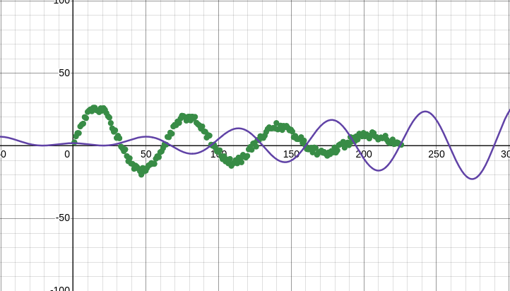

# DA5401 Assignment #2
**Roll no : DA24C021**
**Name : Venkatesh Duraiarasan**

## Task 3-0 : Simple Linear Regression Model for Harmonic Oscillator Data

### Assignment Overview

The objective of this assignment was to model the given harmonic oscillator data using a simple linear regression approach. This model aims to provide a **baseline** for comparison with more complex models, if necessary, and to understand how well a straightforward linear fit performs on the dataset.

### Data Description

The dataset provided consists of amplitude measurements ( y \) of a harmonic oscillator at various time points \( x \). 

### Approach

1. **Feature Transformation:**
   - The feature matrix \( X \) was transformed using polynomial features with a degree of 1. This effectively creates a feature matrix suitable for linear regression by including both the original time variable and a bias term.
2. **Model Training:**
   - Applied Linear Regression to the transformed feature matrix \( $X_{\text{poly}}$ \) and the amplitude data \( y \).

### Results

- **Model Parameters:**
  - **Intercept**= 6.8505
  - **Beta** =  -0.0272
- **SSE (Sum of Squared Errors):**
  - The SSE of the simple linear regression model was calculated as (**SSE** = 25069).

### Visualization

The plot displays:
- **Raw Data:** Represented with red plus signs ('r+').
- **Regression Fit:** Shown as a blue line with the label indicating the SSE value.

## Task 3-2 

## Regression Model for Harmonic Oscillator Dataset

### Task Overview

In this assignment, the objective was to implement a regression model using the provided harmonic oscillator dataset, with the goal of achieving a lower Sum of Squared Errors (SSE) compared to the previous task. The model was to be implemented with appropriate feature transformation to enhance performance.

### Data Description

The dataset consists of amplitude measurements of a damped harmonic oscillator. The independent variable $x$ represents the time index, while the dependent variable $( y )$ represents the amplitude of the oscillator at each time index.

### Feature Transformation

Given the nature of the data from a damped harmonic oscillator, directly applying a linear model was challenging due to the non-linearity of the underlying physical model. The original model $y = A \exp(-dx) \sin(\sqrt{1-d^2} wx + p)$ was difficult to linearize. Therefore, an alternative approximation was used:

$y = c + m_1 x + m_2 \sin(x) + m_3 x \sin(x)$

Here, \( $x$​ \) is the time index transformed into radians to capture the oscillatory nature of the data.

### Why this model $$(y = c + m_1 x + m_2 \sin(x) + m_3 x \sin(x))$$ was considered?

$y = c + m_1 x + m_2 \sin(x) + m_3 x \sin(x)$​ approximates very well for the damped oscillation for the given  limited time interval of the dataset

$m_2\sin(x)$​ - part models the periodicity contained in the dataset as shown below

$m_3 x \sin(x)$ - part models the decaying part by cancelling the $m_2\sin(x)$ part as $x$ or $\theta$​ time increases

so, combining the two graphs $m_2 \sin(x) + m_3 x \sin(x)$  approximates the amplitude data and can be used for both right and left extrapolation 

### Steps Taken

1. **Data Preparation:**
   - Loaded and organized the data into a DataFrame with columns for time \( $x$ \) and amplitude \( $y$ \).
   - Found zero crossings in the amplitude data to estimate the number of cycles and angular frequency.
   - Used a visual inspection to confirm that there were approximately $7$ valid zero crossings.

2. **Feature Transformation:**
   
   - Scaled the time variable \( $x$ \) to radians based on the estimated number of cycles.
   - Created new features for the regression model:
     - $x_{\theta} = \text{angular\_freq} \times x $
     - $\ x2 = \sin(x_{\theta})$
     - $x3 = x_{\theta} \times \sin(x_{\theta})$
   - Added a bias term to the features for the linear regression model.
   
3. **Model Training:**
   - Applied Linear Regression using the transformed features.
   - Predicted amplitude values using the trained model.

4. **Evaluation:**
   - Calculated the SSE of the model's predictions.
   - Compared the SSE to that from Task 1 to ensure improvement.

5. **Visualization:**
   - Plotted the actual data and the regression fit to visually assess the model's performance.
   
     

### Results

- **Model Parameters:**
  - Intercept \( c \): 2.529
  - Coefficients \( $m_1$ \), \( $m_2$ \), \( $m_3$ \): $0.00398$, $24.925$, $-1.054$, respectively.

- **SSE (Sum of Squared Errors):**
  - The SSE achieved with the new model was $1038.86$.

### Visualization

Two plots were generated:
1. **Harmonic Oscillator Data:**
   - Displays the amplitude data along with zero crossing points.
2. **Regression Fit:**
   - Shows the actual amplitude data and the regression line, indicating the fit quality and the SSE value.
   
   

### Conclusion

The regression model with the specified features provided an SSE of $1038.86$, showing an improvement in fitting the data compared to Task 1 SSE=$25069$. The chosen model \( $y = c + m_1 x + m_2 \sin(x) + m_3 x \sin(x)$ \) effectively captures the oscillatory nature of the data, with parameter values indicating a reasonable fit.

## Task 3-3

## Regression Model for Interpolation and Evaluation

### Assignment Overview

In this assignment, the goal was to train a regression model on the harmonic oscillator dataset with a focus on interpolation. The model’s performance was evaluated using the Mean Squared Error (MSE) on both training and test datasets. The process involved feature transformation, data splitting, model training, prediction, and evaluation.

1. **Data Preparation:**
   - Transformed the time variable (\( x \)) into features that capture the harmonic oscillatory behavior:
     - \( $x_{\theta} = \text{angular\_freq} \times x$ \)
     - \( $x2 = \sin(x_{\theta}$) \)
     - \( $x3 = x_{\theta} \times \sin(x_{\theta})$ \)
   - Added a bias term to the feature set.
2. **Data Splitting:**
   - Utilized the `split_data_for_interpolation` function to divide the data into training (80%) and test (20%) subsets.
3. **Feature Matrix Transformation:**
   - Constructed the feature matrix \( X \) for both training and test datasets, including bias, \( $x_{\theta} ), ( x2 )$, and \($ x3 $\).
   - The target variable \( y \) was extracted for both training and test datasets.
4. **Model Training:**
   - Trained a Linear Regression model using the training dataset.
5. **Prediction and Evaluation:**
   - Generated predictions on the training and test datasets.
   - Calculated the Mean Squared Error (MSE) for both datasets to evaluate model performance.

### Results

- **Training Data:**
  - **Mean Squared Error (MSE):** 4.38
  - The plot for the training data shows actual versus predicted values, illustrating the model's performance on the training set.

- **Test Data:**
  - **Mean Squared Error (MSE):** 5.6
  - The plot for the test data shows actual versus predicted values, providing insight into the model’s generalization performance on unseen data.

### Visualization

Two plots were generated:

1. **Training Data Plot:**
   - Shows the actual amplitude data (red plus signs), predicted values (blue dots), and the regression line (yellow line).
   - The plot includes the MSE value for the training data.

2. **Test Data Plot:**
   - Displays the actual amplitude data (red plus signs) and predicted values (blue dots) for the test dataset.
   - The plot includes the MSE value for the test data.

### Model Performance

The Linear Regression model was trained and evaluated with the following outcomes:
- **Training MSE:** 4.38
- **Test MSE:** 5.6

The model performed reasonably well on both training and test datasets, with the test MSE slightly higher than the training MSE, indicating some degree of overfitting. The visual plots confirm that the model captures the general trend of the data, although there is room for improvement in fitting the data more precisely.

## Task 3-4

## Regression Model for Extrapolation and Evaluation

### Assignment Overview

The objective of Task 3-4 was to train a regression model for extrapolation using the harmonic oscillator dataset and evaluate its performance based on the Sum of Squared Errors (SSE). Unlike interpolation, extrapolation involves making predictions beyond the range of the training data, which often poses additional challenges.

### Data Description

The dataset comprises amplitude measurements (\( $y$ \)) of a harmonic oscillator at various time points (\( $x$ \)). The dataset was initially loaded and organized into a DataFrame for analysis.

### Approach

1. **Data Preparation:**
   - Transformed the time variable (\( x \)) into features that capture the harmonic oscillatory behavior:
     - \( $x_{\theta} = \text{angular\_freq} \times x$ \)
     - \( $x2 = \sin(x_{\theta}$) \)
     - \( $x3 = x_{\theta} \times \sin(x_{\theta})$ \)
   - Added a bias term to the feature set.
2. **Data Splitting:**
   - Used the `split_data_for_extrapolation` function to divide the data into training (80%) and test (20%) subsets. Extrapolation typically requires careful splitting to ensure the test set contains data outside the training range.
3. **Feature Matrix Transformation:**
   - Constructed the feature matrix \( X \) for both training and test datasets, including bias, \( $x_{\theta} ), ( x2 )$, and \($ x3 $\).
   - The target variable \( y \) was extracted for both training and test datasets.
4. **Model Training:**
   - Trained a Linear Regression model using the training dataset.
5. **Prediction and Evaluation:**
   - Generated predictions on the training and test datasets.
   - Calculated the Mean Squared Error (MSE) for both datasets to evaluate model performance.

### Model Performance

- **Training Data MSE:** 4.5
- **Test Data MSE:** 6.07

The model showed reasonable performance on the training data but exhibited a higher MSE on the test data, indicating difficulties with extrapolation. This outcome is expected as linear models often struggle with extrapolating beyond the observed data range.

