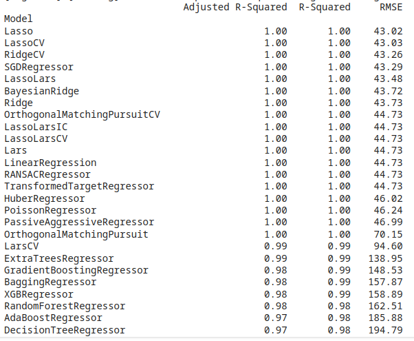

# DA5401 Assignment #3

**Roll no : DA24C021**
**Name : Venkatesh Duraiarasan**

[TOC]

# Task 1: Baseline OLS Model and Initial Evaluation

### Objective:

The task was to fit an Ordinary Least Squares (OLS) model on the dataset and evaluate the baseline Residual Sum of Squares (RSS) to establish a starting point for further model improvement.

### Baseline Model:

- **Formula:** $y = m_0+m_1x_1 + m_2x_2 + m_3x3 + m_4x_4 + m_5x_5$
- **Residual Sum of Squares (RSS):** 71,877.84

### Model Summary:

- **R-squared:** 0.999, indicating that the model explains nearly all the variance in the data.
- **Coefficients:**
  - Intercept: -9655.31
  - x1: -1067.37
  - x2: 0.10
  - x3: -0.06
  - x4: 284.36
  - x5: 1.63
- **Condition Number:** 1.23e+05, indicating potential multicollinearity among the predictors.

### Inference:

- Despite a high R-squared value, the model's RSS is quite large, suggesting poor fit in absolute terms.
- The large condition number indicates strong multicollinearity, meaning that some of the predictors may be linearly dependent.

# Task 2: Exploratory Data Analysis (EDA) and Feature Selection

### Task Overview

The goal of Task 2 was to conduct Exploratory Data Analysis (EDA) on a dataset to understand the relationships between predictor features and how they influence each other, as well as their impact on the output variable, `y`.

### Visualization and Initial Inferences

**Violin Plot & Distribution Analysis:**

- **x1**: Symmetric distribution with very slight skewness (~0.1), closely follows a normal distribution.
- **x2**: Symmetric but with fat tails, indicating more extreme values compared to a normal distribution.
- **x3**: Bimodal and left-tailed, suggesting the presence of two distinct groups within the data.
- **x4**: Symmetric and normal distribution.
- **x5**: Right-skewed with a skewness of ~0.6, and fat tails, indicating higher values are more frequent than expected.
- **y**: Symmetric and normal, with very little skewness (~0.3).

**Violi Plot**

**Distribution Plot, Boxplot, QQ plot** 

**Pair Plot:**

### Correlation Analysis

**Heat Map & Correlation Matrix**

**Scatter_Plots**

#### Key Insights from Correlation:

- **x1 and x4**: Nearly perfect correlation (0.999), indicating that one of these variables is redundant. Since they contribute similar information, one can be removed from the model.
- **x1 and y**: High positive correlation (0.998), suggesting that `x1` is a strong predictor of `y`.
- **x2 and x5**: Slight positive correlation (~0.003), but the scatter plot indicates a potential quadratic relationship. This relationship is weaker compared to others.
- **x3**: Shows a weak correlation with `y`, indicating it might have less predictive power.

### Inferences and Recommendations

- **Remove x4** or **x1**: Due to the very high correlation with `x1`, `x4` any one variable can be safely removed without loss of information.
- **Remove x5**: The weak and non-linear relationship with `y`, combined with its quadratic relationship with `x2`, suggests that `x5` may be unnecessary.
- **Consider transformations**: If `x3` is to be included, further exploration of non-linear modeling techniques or transformations (e.g., logarithmic or polynomial) might improve its relationship with `y`.

### Conclusion

Based on the EDA, it is recommended to exclude `x4` and `x5` from the modeling process. The remaining features, particularly `x1` and `x2`, should be considered for modeling.

# Task 3: Fitting OLS and Reducing Loss

### Objective:

The goal was to fit an Ordinary Least Squares (OLS) model using selected and transformed features, and to check if the model's loss (measured by the Residual Sum of Squares, RSS) was reduced compared to the baseline model.

### Standardising Input Variables:

Explanatory variables X are standardised with mean 0 and varaiance 1, so that coressponding weight terms can made comparable.

### Baseline Model:

- **Formula:** $y = m_0+m_1x_1 + m_2x_2 + m_3x3 + m_4x_4 + m_5x_5$
- **RSS:** **71,877.84** - remains same after scaling input variable

### Model Refinement Process:

1. **Removing Features:**
   
   - **Attempt 1 & 2:** Removing `x2` or `x5` led to a significant increase in RSS (~112,079), indicating worse performance.
   - **Attempt 3 & 4:** Removing `x1` or `x4` showed a slight improvement, but RSS remained higher than the baseline.
   
2. **Adding Interaction Terms:**
   - **Attempt 5:** Adding the interaction term `I(x2*x5)` slightly improved the RSS to 71,875.46.
   - **Attempt 6:** Adding the interaction term `I(x1*x4)` significantly reduced the RSS to **43.30.**
   - **Attempt 7:** Combining both interaction terms (`I(x1*x4)` and `I(x2*x5)`) further reduced the RSS to 42.37.

3. **Final Model:**
   - **Attempt 8:** The final model included `x2`, `x4`, `x5`, and the interaction term `I(x1*x4)`. This model achieved an **RSS** of **44.63** with an **MSE** of **0.0661** on the training data.
     $$
     y = m_0+m_1x_2 + m_2x_4 + m_3x_5 + m_4x_1x_4
     $$

### Model Evaluation:

- **Training MSE:** **0.4774**
- **Testing MSE:** **0.3573**
- **Condition No.** : 3.20

### Inferences:

The introduction of **interaction terms** significantly improved the model's performance, reducing the loss from the baseline RSS of 71,877.84 to **44.63** 

Refined model also **removed multi-collinearity issues** in input data as indicated by the reduction in condition number  from 1.23e+05 to just **3.20**,  in the final model

Model has a **high intercept** which indicates y, the output value, has an offset 

Transformed $x_4$ has higher weight than other input variables

$R^2=1$ indicates all the variance in the output is captured by modified features 

This refined model demonstrated good generalization with a low MSE(**0.357**) on both training and testing datasets.

# Task 4 : Regression Model Comparison Using LazyPredict

### Task Overview

In Task 4, the goal was to use the `lazypredict` package, specifically the `LazyRegressor` class, to automatically build and evaluate various regression models. The performance of these models, as measured by their Root Mean Squared Error (RMSE), was compared against the RMSE of an Ordinary Least Squares (OLS) regression model. 

### Data Preparation

The dataset was split into training and testing sets to evaluate the models

### Building and Evaluating Models with LazyPredict

Using `LazyRegressor`, various regression models were automatically built and evaluated.

The output from `LazyRegressor` included a wide range of regression models, each with their respective RMSE, $R^2$​ score

### Comparison with OLS Regression

For comparison, an Ordinary Least Squares (OLS) regression model was from Task 3 and its RMSE  was calculated to be **0.357**

### Inference: 

Refined Linear regression model performed better than  above general models due to proper feature selection and feature transformation

Also different techniques report different performance metrics due to 

* overfitting, 
* model complexity (ability to capture non-linear relationships in the data more effectively)