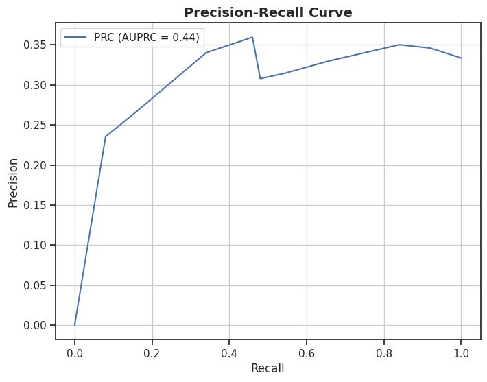

# DA5401 Assignment #3

**Roll no : DA24C021**
**Name : Venkatesh Duraiarasan**

[TOC]

## Report: Binary Classification on the IRIS Dataset Using DummyBinaryClassifier

Each species in the original Iris dataset has an equal number of observations (50). Visualizing sepal length and width reveals a potential for separating *Iris setosa* from the other species.

#### Label Prior of the Binary IRIS Dataset

The majority class "Setosa" is labeled as `True` and the other two classes ("Versicolor" and "Virginica") are labeled as `False`. The label prior probabilities for the binary dataset are computed as follows:

- **Setosa (True)**: 0.33
- **Not Setosa (False)**: 0.67

#### Precision, Recall, and F1 Score vs. Threshold

Evaluated the performance of the DummyBinaryClassifier across various threshold values ranging from 0 to 1 in increments of 0.1. The metrics are plotted as line graphs:

#### Precision-Recall Curve (PRC)

The Precision-Recall Curve plots Precision against Recall. The area under the Precision-Recall Curve (AUPRC) is calculated to be 0.44, indicating a moderate level of performance.

#### Receiver Operating Characteristic Curve (ROC)

The ROC Curve plots the True Positive Rate (TPR) against the False Positive Rate (FPR). The area under the ROC Curve (AUROC) is 0.49, suggesting a performance level close to **random guessing**.

#### Visualization of Decision Boundaries

Visualized the decision boundaries of the DummyBinaryClassifier for different probability values (`p`) and distributions (`bernoulli`, `gaussian`, `uniform`). The decision boundaries are shown for `p` values of 0, 0.25, 0.5, 0.75, and 1.

### Summary

The DummyBinaryClassifier exhibits limited predictive power as shown by the low AUPRC and AUROC values, which are close to random guessing. The decision boundary visualizations illustrate the impact of different `p` values and distributions on the classification decision surface