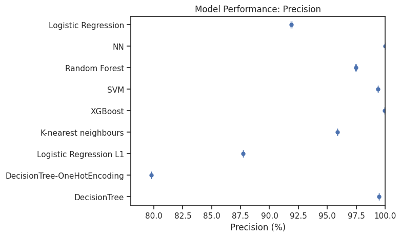

# DA5401 Assignment #5

**Roll no : DA24C021**
**Name : Venkatesh Duraiarasan**

[TOC]

### **Report on Nursery Dataset Classification and Bipolar Sigmoid Analysis**

#### **Objective**
The goal of this assignment is
1. To perform classification on the Nursery dataset using several machine learning models and compare their performance with baseline models.
2. To explore and analyze the behavior of the bipolar sigmoid function and compare it with the $(\tanh(x))$ function for various values of \(a\), and investigate the linearity range of the bipolar sigmoid for different values of \(a\).

---

### **Part 1: Classification on the Nursery Dataset**

#### **Dataset Overview**
The Nursery dataset, fetched from UCI Machine Learning Repository (ID 76), contains 8 categorical features and 3 class labels. The dataset is split into training, validation, and test sets, and multiple classifiers are applied to evaluate their performance.

> Note : count of samples with 'recommend' as labels is only two. This may pose a constraint during classification  as the train set may not have these two samples have for training

#### **Models Used**

1. **Decision Tree (with Ordinal Encoding **)
2. **Decision Tree (with One-Hot Encoding)** 
3. **Logistic Regression (with L1 regularization)**
4. **k-Nearest Neighbors**

#### **Encoding Strategies for features**
- **Ordinal Encoding:** For categorical features, an ordinal encoding was applied where categories are converted to numerical values. used in **Decision Tree (with Ordinal Encoding)** 
- **One-Hot Encoding:** The categorical features were transformed using one-hot encoding to ensure each category is represented as binary vectors. used in **Decision Tree (with One-Hot Encoding)** ,  **Logistic Regression**, **k-Nearest Neighbors**

#### Encoding Strategies for labels

- **Label Encoding:** For categorical labels, an label encoding was applied where categories are converted to numerical values. Used in **Decision Tree (with Ordinal Encoding)** , **k-Nearest Neighbors**, 
- **Label Binarizer:** For categorical labels, an label binarizer  was applied where categories are converted to numerical values. and used in **Decision Tree (with One-Hot Encoding)** , **Logistic Regression**

#### **Evaluation Metrics**
Models were evaluated based on the following metrics:
- **Accuracy**
- **Precision**

The average and variance for each metric were computed over 5 trials using cross-validation.

#### **Hyperparameter Tuning**
For each model, hyperparameter tuning was performed using `GridSearchCV` to find the best parameters, such as the depth of decision trees, the number of neighbors in k-NN, and the regularization strength in logistic regression.

#### **Results**
The performance of each classifier, including Decision Trees (with and without One-Hot Encoding), Logistic Regression, and k-Nearest Neighbors, was compared with the baseline models found in the UCI dataset description.

| Model                          | Accuracy (%) | Precision (%) |
| ------------------------------ | ------------ | ------------- |
| Decision Tree (Ordinal)        | 99.33        | 99.48         |
| Decision Tree (One-Hot)        | 99.63        | 79.77         |
| Logistic Regression (L1)       | 92.53        | 87.71         |
| k-Nearest Neighbors            | 95.93        | 95.87         |
| **Baseline Models**            |              |               |
| XGBoost                        | 99.97        | 99.97         |
| SVM                            | 99.20        | 99.37         |
| Random Forest                  | 98.03        | 97.47         |
| Neural Network (NN)            | 100.00       | 100.00        |
| Logistic Regression (Baseline) | 92.25        | 91.87         |

#### **Visualization**

To visualize model performance, error bars were plotted to show the mean accuracy and precision along with the variance.

- **Accuracy:** Most models achieved accuracy above 90%, with Decision Tree (One-Hot) outperforming the decision tree in both encoding types.
- **Precision:** Similar trends were observed for precision, with baseline models like XGBoost and Neural Network (NN) achieving the high scores.

---

### **Part 2: Bipolar Sigmoid Function Analysis**

#### **Objective**
The second task focuses on constructing the bipolar sigmoid function and comparing it with the $(\tanh(x))$ function. Additionally, the response of the bipolar sigmoid for various values of \(a\) was analyzed, and the linearity range of the bipolar sigmoid function was evaluated.

#### **Definitions**
- **Sigmoid Function:**
  $$
  \text{sigmoid}(x) = \frac{1}{1 + e^{-x}}
  $$
  
- **Bipolar Sigmoid:**
  $$
  \text{bipolar\_sigmoid}(x) = 2 \cdot \text{sigmoid}(x) - 1
  $$
  The bipolar sigmoid outputs values in the range of \([-1, 1]\), similar to $(\tanh(x))$.

#### **Comparison: Bipolar Sigmoid vs $(\tanh(x))$**
For different values of \(a\) in the range \([-5, 5]\), the responses of the functions ($\tanh(ax))$ and bipolar\_sigmoid(ax) were plotted. Both functions exhibit similar behavior, but $(\tanh(ax))$ has a steeper slope for larger \(a\).

#### **Linearity Range Evaluation**
The linearity range of \(x\) for each value of \(a\) in bipolar\_sigmoid(ax) was analyzed by finding when the bipolar sigmoid deviates from its linear approximation by more than 5%. The results show that for all values of \(a\), the bipolar sigmoid remains close to its linear approximation within the range \([-2, 2]\).

#### **Findings**
- **For small values of \(a\):** The function's linear region is wider.
- **For large values of \(a\):** The function becomes steeper, and the linear region narrows.

---

