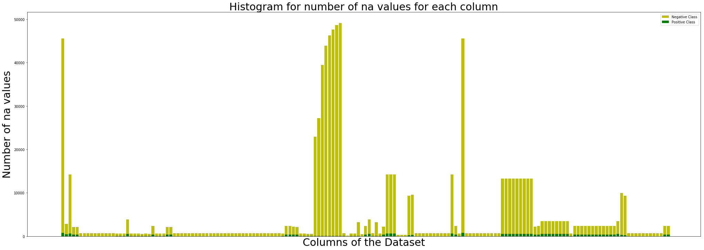
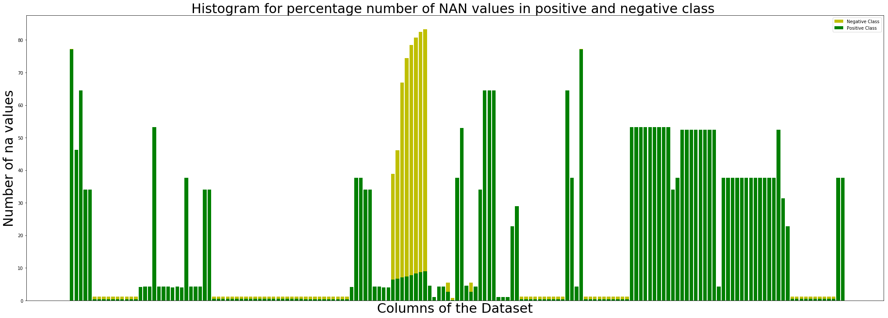
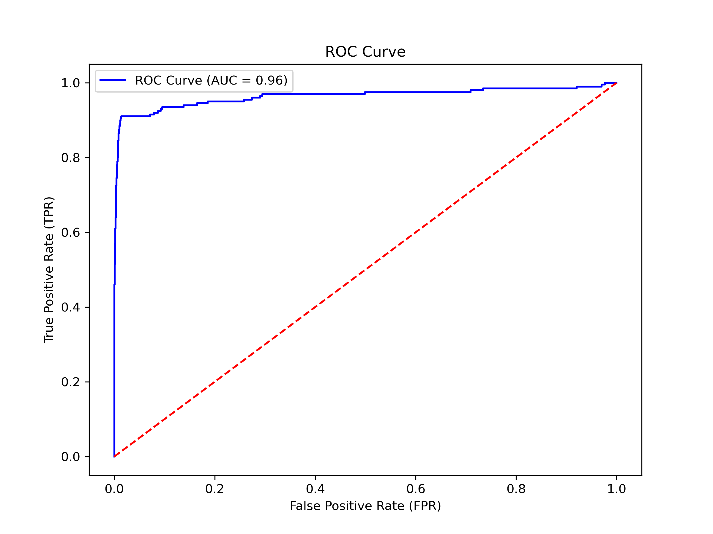
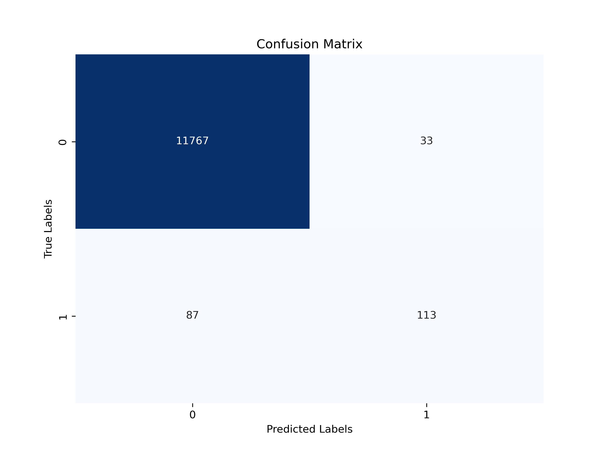
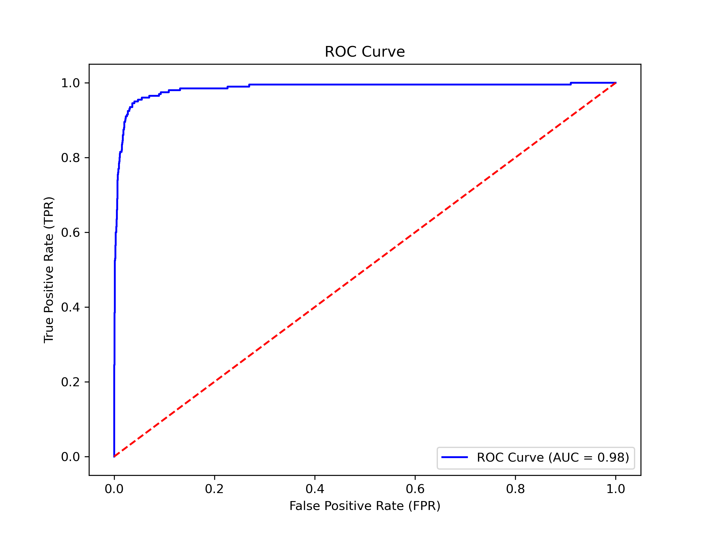
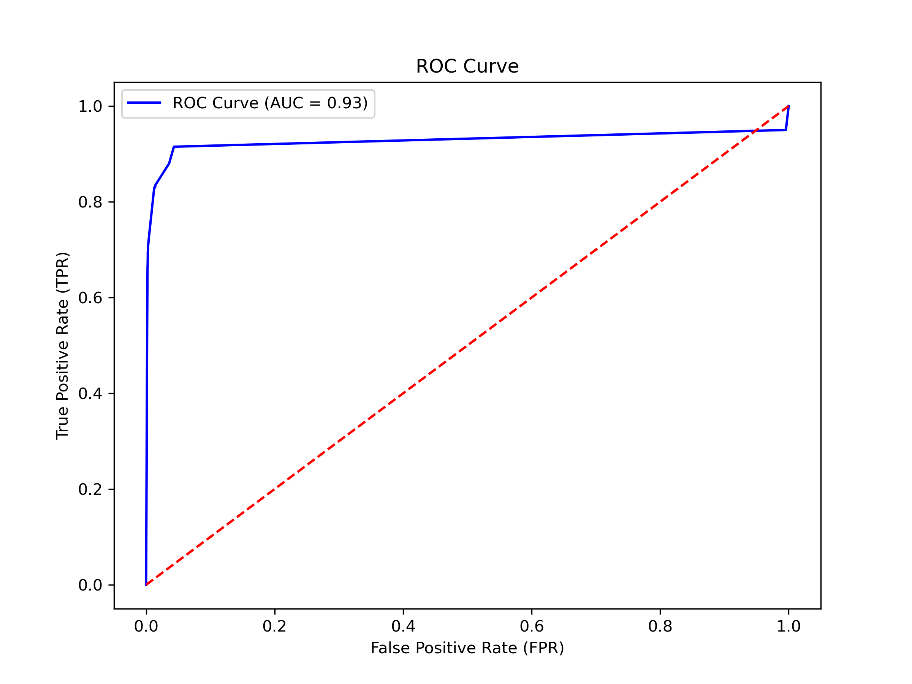

# DA5401 Assignment #7

**Roll no : DA24C021**
**Name : Venkatesh Duraiarasan**

[TOC]

### Task 0 : Data Preprocessing for Class-Imbalance in IDA2016 Challenge Dataset

**Dataset Overview:**

- **Problem:** Binary classification (target = {‘pos’, ‘neg’})
- **Features:** 170 features
- **Data Points:** 60,000 instances
- **Class Imbalance:** 1:59 ratio between positive and negative samples (highly imbalanced)
- **Dataset Files:** `aps_failure_training_set.csv` (training set)
- 
- 

------

#### Preprocessing Steps:

1. **Loading Data:**
   - The dataset was loaded into a DataFrame, revealing 60,000 rows and 171 columns (including the 'class' column).
2. **Handling Missing Values:**
   - Missing values, denoted as "na", were identified.
   - These "na" values were replaced with `pd.NA` for uniform handling.
   - The missing values for each feature were filled using the **mode** (most frequent value) to minimize data distortion.
3. **Standardization:**
   - Features were standardized using **StandardScaler** to ensure that all features have a mean of 0 and a standard deviation of 1. This is necessary for PCA and other models sensitive to feature scaling.
4. **Feature Selection Using Variance Threshold:**
   - Applied a **VarianceThreshold** with a threshold of 0.01 to remove low-variance features. This reduced the feature count from 170 to fewer relevant ones.
   - **Result:** Reduced the dataset from 170 to fewer significant features.Features remaining after Variance Threshold: 168
5. **Correlation Analysis:**
   - Computed a **correlation matrix** to identify highly correlated features (correlation > 0.8).
   - Removed features with high correlations to avoid multicollinearity and redundant information.
   - Highly correlated features to be dropped: ['af_000', 'ag_004', 'ag_007', 'ah_000', 'am_0', 'an_000', 'ao_000', 'ap_000', 'aq_000', 'ay_003', 'az_005', 'ba_000', 'ba_001', 'ba_002', 'ba_003', 'ba_004', 'ba_005', 'ba_006', 'bb_000', 'bg_000', 'bh_000', 'bi_000', 'bj_000', 'bl_000', 'bn_000', 'bo_000', 'bp_000', 'bq_000', 'br_000', 'bt_000', 'bu_000', 'bv_000', 'bx_000', 'by_000', 'cb_000', 'cc_000', 'cf_000', 'ci_000', 'ck_000', 'cn_001', 'cn_002', 'cn_003', 'cn_004', 'cn_005', 'cn_006', 'co_000', 'cq_000', 'cs_000', 'cs_002', 'cs_003', 'cs_005', 'cx_000', 'cz_000', 'dc_000', 'dm_000', 'dn_000', 'dp_000', 'dt_000', 'dv_000', 'ed_000', 'ee_000', 'ee_001', 'ee_002', 'ee_003', 'ee_004']
6. **Final Dataset:**
   - After variance and correlation filtering, the number of features was further reduced.
   - The final dataset, consisting of important features and the target class, was saved as `filtered_features.csv`.

------

#### Outcome:

- **Original Shape:** (60,000, 171)
- **Final Shape after Preprocessing:** Reduced features count with only significant features retained for modeling. (Exact number depending on filtering). **(60000, 103)**

### Task 1: Comparative Evaluation of Baseline Classifiers  - Performance metrics on the train and test partitions.

#### Dataset Overview:

- **Training Set:** 48,000 samples
- **Test Set:** 12,000 samples
- **Task:** Binary classification with highly imbalanced classes (1:59, positive to negative)

#### Classifiers and Results:

1. **Support Vector Classifier (SVC):**
   - **Test Accuracy:** 99.14%
   - **Train Accuracy:** 99.62%
   - **Precision (pos):** 0.81
   - **Recall (pos):** 0.63
   - **F1-score (pos):** 0.71
   - **Inference:** SVC shows excellent overall accuracy but lower recall for the minority class (positive). This suggests that while SVC classifies negatives well, it struggles with detecting positives.
   - 
   - 
2. **Logistic Regression (LogReg):**
   - **Test Accuracy:** 99.0%
   - **Train Accuracy:** 98.99%
   - **Precision (pos):** 0.77
   - **Recall (pos):** 0.56
   - **F1-score (pos):** 0.65
   - **Inference:** Logistic Regression performs slightly worse than SVC on detecting the minority class, with lower recall and F1-score. Despite high overall accuracy, it underperforms in capturing positive cases.
   - 
   - 
3. **Decision Tree (DT):**
   - **Test Accuracy:** 99.22%
   - **Train Accuracy:** 99.64%
   - **Precision (pos):** 0.83
   - **Recall (pos):** 0.67
   - **F1-score (pos):** 0.74
   - **Inference:** Decision Tree exhibits the best performance for the positive class in terms of recall (0.67) and F1-score (0.74), making it more capable than SVC and LogReg in identifying positive cases.
   - 
   - 

------

#### Comparative Inference:

- **Accuracy:** All models demonstrate very high accuracy (>99%), but this is driven by the overwhelming majority of negative cases.
- Minority Class Detection (pos):
  - **Decision Tree** performs the best, with the highest recall (0.67) and F1-score (0.74), indicating better capability to capture positive cases.
  - **SVC** is a close second, but its recall for positive cases is slightly lower at 0.63.
  - **Logistic Regression** struggles with the minority class, having the lowest recall (0.56) and F1-score (0.65).

**Conclusion:** Despite high overall accuracy, performance on the minority class is critical. The Decision Tree model stands out as the best for imbalanced classification, followed by SVC. Logistic Regression lags in detecting the minority class.

### Task 2 : Addressing Class Imbalance in Classifiers

#### Task Overview:
- The task involves improving classification performance (macro average F1-score) by addressing class imbalance using various techniques, applied to SVC, Logistic Regression, and Decision Tree classifiers.

---

### Techniques Applied:

1. **Baseline Classifiers:**
   - **SVC Baseline:** F1-score: 0.85
   - **Logistic Regression Baseline:** F1-score: 0.82
   - **Decision Tree Baseline:** F1-score: 0.87

2. **Approach a:** **Undersampling/Oversampling**:
   - **RandomUnderSampler:** Majority class is undersampled.
   - **RandomOverSampler:** Minority class is oversampled.
   - **SMOTE:** Minority class is synthetically oversampled using SMOTE.

   **Results:**
   - **SVC:** F1-scores (all methods): 0.84 (slightly lower than baseline)
   - **LogReg:** F1-scores (all methods): 0.80-0.81 (slightly lower than baseline)
   - **DT:** F1-scores (all methods): 0.81-0.82 (lower than baseline)

   **Inference:** These sampling techniques generally underperform, likely due to insufficient representation of the majority class when undersampling or instability from oversampling.

3. **Approach b:** **Class Weights (Inversely Proportional to Class Size)**:
   - **Weighted SVC:** `class_weight='balanced'`
   - **Weighted Logistic Regression:** `class_weight='balanced'`
   - **Weighted Decision Tree:** Custom class weights applied (pos: 10, neg: 15).

   **Results:**
   - **SVC:** F1-score: 0.86 (better than baseline)
   - **LogReg:** F1-score: 0.83 (better than baseline)
   - **DT:** F1-score: 0.85 (slightly lower than baseline)

   **Inference:** Using class weights leads to an improvement for SVC and Logistic Regression, balancing class impact without oversampling or undersampling.

4. **Approach c:** **Sample Weights**:
   - Penalties are applied based on the class of each sample using `compute_sample_weight`.

   **Results:**
   - **SVC:** F1-score: 0.86 (better than baseline)
   - **LogReg:** F1-score: 0.83 (better than baseline)
   - **DT:** F1-score: 0.85 (slightly lower than baseline)

   **Inference:** Sample weighting improves performance for SVC and Logistic Regression, similar to class weights, but is more flexible in penalizing specific samples.

---

### Comparative Inference:
- **Best Method for SVC:** Both **class_weight** and **sample weights** improve macro average F1-score (0.86).
- **Best Method for Logistic Regression:** **Class weights** and **sample weights** yield better performance (F1-score: 0.83).
- **Decision Tree:** The baseline (F1-score: 0.87) remains the best; other methods provide slightly lower scores.

**Conclusion:** Class weights and sample weights are more effective than resampling techniques for addressing imbalance, particularly for SVC and Logistic Regression.